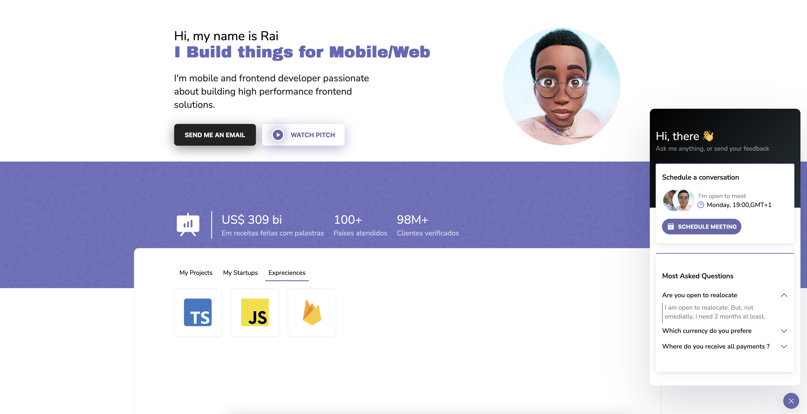

# My Portfolio ( <a href="https://typerguy-io.vercel.app/)" target="_blank"> Clique para ver 👆 </a>)

## Description

 This is my personal portfolio. This project Was made to share all my profissional information 

## 💻 Programming Languages

- Typescript

## 📚 Libraries & frameworks

- ReactJS
- Nextjs
- Styled-Components
- Lottie-React
- SASS
- GraphQl
- GraphCMS

## 🗺️ Roadmap

- [x] Add Changelog
- [x] Add back to top links
- [ ] Add Additional Templates w/ Examples
- [ ] Add "components" document to easily copy & paste sections of the readme
- [ ] Multi-language Support
    - [ ] Chinese
    - [ ] Spanish

See the [open issues](https://github.com/othneildrew/Best-README-Template/issues) for a full list of proposed features (and known issues).
